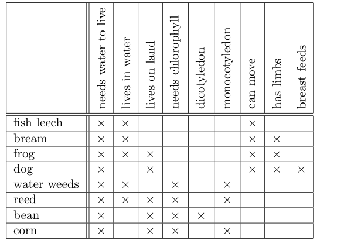

# An example of a context for binary data
Here we provide a context for a well known example ['Live in water'](http://www.upriss.org.uk/fca/examples.html).

In a cross-table form it can be represented as on the next figure.



```json
[{
	"ObjNames":[
		"fish leech",
		"bream",
		"frog",
		"dog",
		"water weeds",
		"reed",
		"bean",
		"corn"
	],
	"Params":{
		"AttrNames":[
			"needs water to live",
			"lives in water",
			"lives on land",
			"needs chlorophyll",
			"dicotyledon",
			"monocotyledon",
			"can move",
			"has limbs",
			"breast feeds"
		]
	}
},{
	"Count": 8,
	"Data": [
		{"Count":3,"Inds":[0,1,6]},
		{"Count":4,"Inds":[0,1,6,7]},
		{"Count":5,"Inds":[0,1,2,6,7]},
		{"Count":5,"Inds":[0,2,5,7,8]},
		{"Count":4,"Inds":[0,1,3,5]},
		{"Count":5,"Inds":[0,1,2,3,5]},
		{"Count":4,"Inds":[0,2,3,4]},
		{"Count":4,"Inds":[0,2,3,5]}
	]
}]
```
